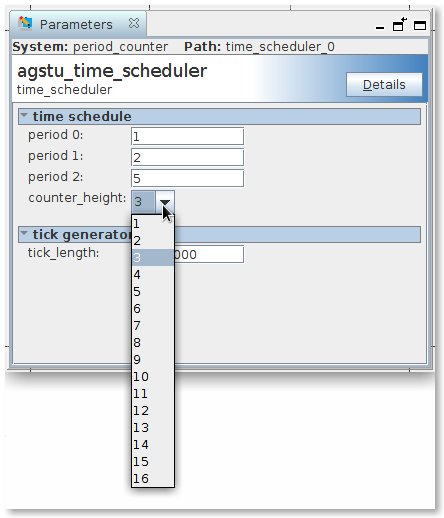

# COMPONENT ARCHITECTURE

The **Time Scheduler** component manages the execution of functions according to a predefined time schedule. The component's functionality is shown in [Figure 1](#rec-spec-figure_1).

<!-- <div style="float:center" markdown="1"> -->

<!-- <a name="rec-spec-figure_1"></a> -->

<!-- || -->
<!-- |---| -->
<!-- |*Figure 1. Time scheduler functional diagram.*| -->

<!-- </div> -->
 <figure>
  
  <figcaption>Figure.1 Time scheduler functional diagram.</figcaption>
</figure> 

The functionality of the component is described as follows:

* The tick function (shown as **T** in the diagram) generates a tick signal derived from the system clock.

* This tick signal is distributed to a set of period counters. Each period counter counts tick pulses up to a specified period limit, which is individually defined for each counter. When a counter reaches its period limit, it asserts its own interrupt request (IRQ), sent to the IRQ selector.

* The **IRQ selector** handles individual period IRQs and multiplexes them over a single shared interrupt line (Avalon® Interrupt Interface) to the Nios II® processor. A simple priority scheme is used while multiplexing the individual IRQs. The IRQ selector uses acknowledge signals and a vector parameter for multiplexing and prioritizing individual IRQs. These signals are transferred via the Avalon® Memory-Mapped Interface.

* The **Interrupt Service Routine (ISR)** reads the vector and acknowledges that the IRQ line is free. It then calls the corresponding period function based on the vector. Upon completion, the ISR acknowledges the completion of the period function execution.
  
  

## Hardware architecture.

The hardware module architecture is shown on [Figure 2](#fig-hw-arc).
<!-- <div style="float:center" markdown="1"> -->


<!-- || -->
<!-- |:---:| -->
<!-- |*Figure 2. Time scheduler hardware module architecture.*| -->

<!-- </div> -->
<!-- <a name="fig-hw-arc"></a> -->
<figure>
  
  <figcaption>Figure.1 Time scheduler hardware architecture diagram.</figcaption>
</figure> 

The hardware module is connected to the Avalon bus and is controlled via a set of registers. The hardware module consists of three blocks. Each block has control/data registers connected to the Avalon Memory-Mapped interface. All the registers are available for the software running on the Nios II processor connected to the Avalon bus. The blocks that constitute the hardware module are:

* **Timer function**. This block generates tick pulses. The tick pulse period is configured in the hardware synthesis phase. The tick function can be started and stopped via a register.
* **Period counter**. This block contains a set of tick pulse counters. The number of counters is defined in the hardware synthesis phase. The period limits can be set individually in the hardware synthesis phase and via registers as well. The period counters feed the generated IRQ to the IRQ selector block.
* **IRQ selector**. This block manages the individually generated period IRQs over a single interrupt line. The IRQ selector uses the period index as a vector. The IRQ selector expects an acknowledgment for IRQ taking and an acknowledgment for period function completion. The period index represents the priority of the period. Priority 0 is the highest. The lower the period index, the higher the priority.

### Tick function.

<!-- <div> -->

<!-- <a name="fig-tick-function-block-symbol"></a> -->
<!--  -->
<!-- <figcaption>Figure 8. Tick function block symbol.</br></br></br></figcaption> -->

<!-- </div> -->
<figure>
  
  <figcaption>Figure.1 Tick function block symbol.</figcaption>
</figure> 

<!-- <div> -->

<!-- <a name="fig-tick-function-architecture"></a> -->
<!--  -->
<!-- <caption>Figure 8. Tick function architecture.</br></br></br></caption> -->

<!-- </div> -->

<figure>
  
  <figcaption>Figure.1 Tick function architecture.</figcaption>
</figure> 

### IRQ selector.

<!-- <div> -->

<!-- <a name="fig-irq-selector-block-symbol"></a> -->
<!--  -->
<!-- <caption>Figure 9. IRQ selector block symbol.</br></br></br></caption> -->

<!-- </div> -->

<figure>
  
  <figcaption>Figure.1 IRQ selector block symbol.</figcaption>
</figure> 

<!-- <div> -->

<!-- <a name="fig-irq-selector-architecture"></a> -->
<!--  -->
<!-- <caption>Figure 9. IRQ selector architecture.</br></br></br></caption> -->

<!-- </div> -->

<figure>
  
  <figcaption>Figure.1 IRQ selector architecture.</figcaption>
</figure> 
  
## Software architecture ##

The software driver of the **Time Scheduler** component is designed to be included in a **Board Support Package** (BSP). The component's software architecture is shown in [Figure 3](#fig-sw-arc).

<!-- <div style="float:center" markdown="1"> -->

<!-- <a name="fig-sw-arc"></a> -->

<!-- || -->
<!-- |:---:| -->
<!-- |*Figure 3. Time scheduler software architecture.*| -->

<!-- </div> -->

<figure>
  
  <figcaption>Figure.1 Time scheduler hardware architecture diagram.</figcaption>
</figure> 

The device driver includes the following:

* **Device Instantiation** and **Device Initialization** blocks. HAL (Hardware Abstraction Layer) uses these blocks to construct the system startup section.
  The *Device Instantiation* block creates a device instance for each Time Scheduler device present in the system.
  The *Device Initialization* block performs initial setup and configuration of each Time Scheduler device present in the system.

* The **Interrupt Service Routine (ISR)** interacts with the Time Scheduler device through the *Device Register Interface*.
  The ISR receives a pointer to the device instance (requiring service) as an input parameter.
  Each device instance includes a pointer to a period function table, which is provided by the user software for each Time Scheduler device present in the system.

* The **Device Register Interface** provides access to the Time Scheduler device referenced by the corresponding device instance.

# COMPONENT CONFIGURATION. #

The configuration of the **Time Scheduler** component is defined in three stages:

* During system creation using the **Platform Designer** tool in Intel® Quartus® Prime Software
* During software development using the **Nios® II Embedded Design Suite (EDS)**
* At runtime via the **Device Register Interface**, during system initialization and/or by user software

The Time Scheduler component is packaged as an IP component for the Platform Designer tool. In the tool, it is referenced as `agstu_time_scheduler`. The file structure of the IP component is shown in Figure 6.

<!-- <div style="float:center" markdown="1"> -->

<!-- <a name="fig-ip-file-structure"></a> -->

<!-- || -->
<!-- |:---:| -->
<!-- |*Figure 6. Time scheduler IP file structure.*| -->

<!-- </div> -->

<!-- <a name="fig-ip-file-structure"></a> -->

<!--  -->

<!-- <caption>Figure 6. Time scheduler IP file structure.</br></br></br></br></caption> -->

<!-- </div> -->

<figure>
  
  <figcaption>Figure.1 Time scheduler scheduler IP file structure.</figcaption>
</figure> 


The default time schedule is defined during creation of the target system with Platform Designer tool. The following parameters  defined in this phase:

* **Tick pulse period** – This parameter can only be configured in the Platform Designer tool.
* **Number of periods** – This parameter can only be configured in the Platform Designer tool.
* **Initial period limit values** for each period – These parameters can be configured both in the Platform Designer tool and at runtime.
  

<!-- | Parameter            | Description                                                             | Configured in:             | -->
<!-- |----------------------|-------------------------------------------------------------------------|----------------------------| -->
<!-- | `tick_length`        | tick pulse period                                                        | Platform Designer          | -->
<!-- | `counter_height`     | number of the periods in the system                                     | Platform Designer          | -->
<!-- | `period_limit`[0:15] | period limits for period counters                                       | Platform Designer, Runtime | -->
<!-- | period functions      | Period function pointers collected in a table (period function table);  provided to the driver by user software.| Preprocessor time, Runtime | -->
<!-- |                      |                                                                         |                            | -->


<table>
<caption>
Table 1. Component parameter configuration
</caption>
<colgroup>
<col style="width: 17%" />
<col style="width: 59%" />
<col style="width: 22%" />
</colgroup>
<thead>
<tr><th>Parameter</th><th>Description</th><th>Configured in:</th></tr>
</thead>
<tbody>
<tr>
<td><code>tick_length</code></td><td>tick pulse period</td><td>Platform Designer</td></tr>
<tr>
<td><code>counter_height</code></td><td>number of the periods in the system</td><td>Platform Designer</td>
</tr>
<tr><td><code>period_limit</code>[0:15]</td><td>period limits for period counters</td><td>Platform Designer, Runtime</td>
</tr>
<tr>
<td>period functions</td>
<td>Period function pointers collected in a table (period function
table); provided to the driver by user software.</td>
<td>Preprocessor time, Runtime</td>
</tr>
<tr>
<td></td>
<td></td>
<td></td>
</tr>
</tbody>
</table>


## Configuration during system creation with Platform Designer tool.


An initial time schedule can be defined when the component is integrated into the target system. This is done in the **Parameters** window of the component. An example of the Parameters window is shown in [Figure 7](#fig-ip-parameter-window).

<!-- <div> -->

<!-- <a name="fig-ip-parameter-window"></a> -->
<!--  -->
<!-- <caption>Figure 7. Time scheduler IP Parameters window.</br></br></br></caption> -->

<!-- </div> -->

<figure>
  
  <figcaption>Figure.1 Time scheduler IP Parameters window.</figcaption>
</figure> 

The definitions of the parameters and the way they appear and behave in the Parameters window are specified in the `agstu_time_scheduler_sw.tcl` file. The `counter_height` and `tick_length` parameters are defined as integer values. Their definitions are similar and largely self-explanatory. As an example, the definition of `tick_length` is shown below:

``` tcl
add_parameter tick_length NATURAL 25000000 "tick pulse period length in system clock pulses"
set_parameter_property tick_length DEFAULT_VALUE 25000000
set_parameter_property tick_length DISPLAY_NAME tick_length
set_parameter_property tick_length TYPE NATURAL
set_parameter_property tick_length UNITS None
set_parameter_property tick_length ALLOWED_RANGES 3:0x7fffffff
set_parameter_property tick_length DESCRIPTION "tick pulse period length in system clock pulses"
set_parameter_property tick_length HDL_PARAMETER true
```

The parameters `per0` .. `per15` represent initial value for the period limits. These parameters are assigned as constant values in the HDL design of the time scheduler component.

The `HDL_PARAMETER` property ensures that the parameter value is assigned to the corresponding generic in the HDL design.

After the parameters are set in the Parameters window, the following adjustments are performed:

``` tcl
proc post_elaboration {} {
    set_module_assignment embeddedsw.CMacro.HEIGHT \
	[get_parameter_value counter_height]

    add_interface_port avalon_slave_0 addr address Input \
	[log2ceil [expr {[get_parameter_value counter_height] + 1 + 4}]]

}
```

By this procedure, the final value of counter_height is passed to the BSP (Board Support Package), and the bit width of the address input is adjusted to accommodate four 32-bit control registers and, plus one 32-bit register for each period limit.

## Configuration with Nios® II Embedded Design Suite (EDS).

### Component configuration in software driver.

The software driver creates the following for each time scheduler component in the target system:

  * An instance, which represents a record containing information about the corresponding component, including:
    * base address
	* IRQ line
	* interrupt controller ID
	* pointer to a period function table.
  
  * An initialization procedure.

Both, the instance and the initialization procedure are implemented as macros. These macros are placed into the system initialization section during BSP generation. The pointer to a period function table sets to NULL during compilation of the BSP. If the user software does not provide a pointer to a period function table, the component remains inactive till the pointer is set at runtime.

User software defines a period function table. It is created during compilation of the user software. During linking the pointer to the period function table is assigned to the component instance. The period function table can be changed at runtime by the user software. The software driver provides a preprocessor macro for defining a period function table.

*(Continue here with your details about how preprocessor parameters are used in the Nios II EDS environment)*
