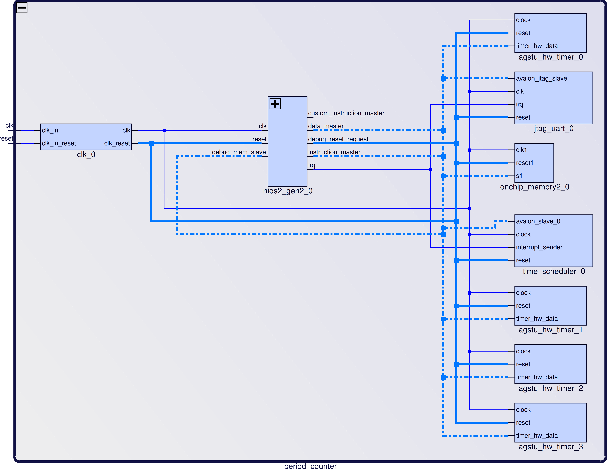

# VALIDATION

The validation of the Time Scheduler Component is performed on the DE10-Lite card. The test system shematic is shown in the figure 1. The test system was created with the Platform Designer tool.

  <a name="fig-1-validation">
 <figure>
  
  <figcaption>Figure 1. Test system schematic diagram.</figcaption>
</figure> 
  </a>

The four `agstu_hw_timer`-s are used for measuring of the defined time schedule. The Quartus project for the test system and the text of the test program are placed in the `examples` folder of the `agstu_time_scheduler` ip folder. A protocol of the test program execution is shown bellow.

```
Period 2 limit 16
Period 1 limit 6
Period 0 limit 1
-- background time adjustment 17
function 101c4
..irq vector 0, depth 1+++ Period 0 +++ 0 CounteD d150, PerioD 0
function 101c4
..irq vector 0, depth 1+++ Period 0 +++ 1 CounteD d357, PerioD 2faf03a
function 101c4
..irq vector 0, depth 1+++ Period 0 +++ 2 CounteD d357, PerioD 2faf037
function 10270
..irq vector 1, depth 1+++ Period 1 ++.+ 0 function 101c4
..irq vector 0, depth 2+++ Period 0 +++ 3 CounteD d357, PerioD 2faf03c
counted 2faf0d3, period 0
function 101c4
..irq vector 0, depth 1+++ Period 0 +++ 4 CounteD d357, PerioD 2faf037
function 101c4
..irq vector 0, depth 1+++ Period 0 +++ 5 CounteD d357, PerioD 2faf03e
function 101c4
..irq vector 0, depth 1+++ Period 0 +++ 6 CounteD d357, PerioD 2faf03e
function 10270
..irq vector 1, depth 1+++ Period 1 ++.+ 1 function 101c4
..irq vector 0, depth 2+++ Period 0 +++ 7 CounteD d357, PerioD 2faf03a
counted 2faf0e2, period a720961
function 101c4
..irq vector 0, depth 1+++ Period 0 +++ 8 CounteD d357, PerioD 2faf03b
Xfunction 101c4

```
The parameter `depth` indicates preemption depth.

The validation approved.
