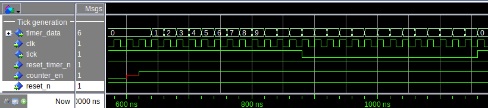
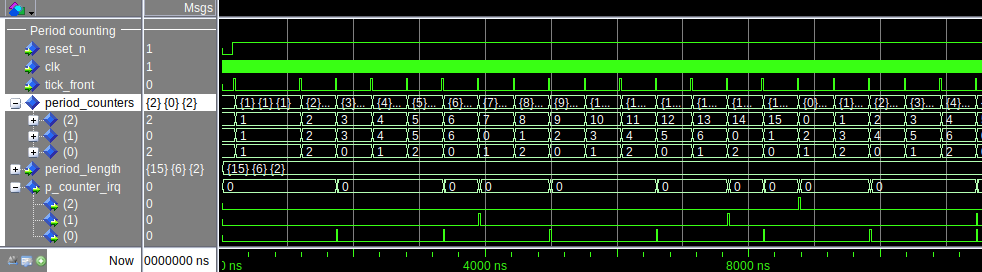
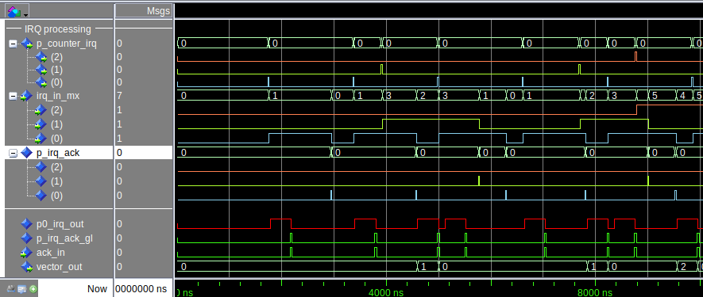
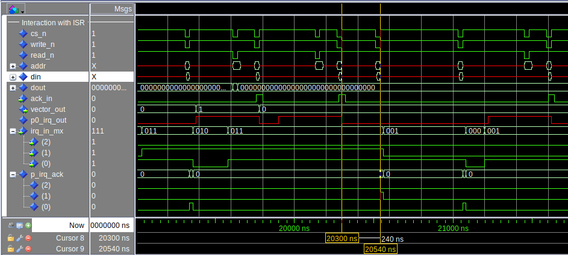

# VERIFICATION

The Time Scheduler component is verified by simulating its behaviour with ModelSim tool. The verification is performed on the test bench, provided with the source code of the time scheduler component. The simulation verifies the functionality of all blocks within the component. The simulation also includes the emulation of an ISR. The test results are presented in four functional categories:

  * Tick generation
  * Period counting
  * IRQ processing
  * Interaction with ISR.

For the simulation tests the Time Scheduler component was generated with following target parameters shown in the table 3.

<!-- <caption> -->
<!-- Table 2: Target Test Configuration Parameters for the Time Scheduler Component -->
<!-- </caption> -->

<!-- | Parameter name   | target value | -->
<!-- |:-----------------|:-------------| -->
<!-- | `tick_length`    | 27 system clock cycles           | -->
<!-- | `counter_height` - number of period counters in the system | 3            | -->
<!-- | `per0` - length of period 0 in ticks           | 3 ticks           | -->
<!-- | `per1` - length of period 1 in ticks           | 7 ticks           | -->
<!-- | `per2` - length of period 2 in ticks           | 16 ticks          | -->

<table>
<caption>
Table 3. Target Test Configuration Parameters for the Time Scheduler Component
</caption>
<colgroup>
<col style="width: 56%" />
<col style="width: 43%" />
</colgroup>
<thead>
<tr>
<th style="text-align: left;">Parameter name</th>
<th style="text-align: left;">target value</th>
</tr>
</thead>
<tbody>
<tr>
<td style="text-align: left;"><code>tick_length</code></td>
<td style="text-align: left;">27 system clock cycles</td>
</tr>
<tr>
<td style="text-align: left;"><code>counter_height</code> - number of
period counters in the system</td>
<td style="text-align: left;">3</td>
</tr>
<tr>
<td style="text-align: left;"><code>per0</code> - length of period 0 in
ticks</td>
<td style="text-align: left;">3 ticks</td>
</tr>
<tr>
<td style="text-align: left;"><code>per1</code> - length of period 1 in
ticks</td>
<td style="text-align: left;">7 ticks</td>
</tr>
<tr>
<td style="text-align: left;"><code>per2</code> - length of period 2 in
ticks</td>
<td style="text-align: left;">16 ticks</td>
</tr>
</tbody>
</table>

## Tick generation verification.

The time diagram from the tick generation verification is shown in [figure 13](#fig-1-tick-generation-verification).
The only parameter checked in this test is `tick_length`.

<a name="fig-1-tick-generation-verification">
<figure>
  
  <figcaption>Figure 13. Period Counter block symbol.</figcaption>
</figure> 
</a>

The test results:
  * `tick_length` target value 27 clock cycles.
  * `tick_length` measured value 27 clock cycles. The tick function block formed `tick` signal from 27 clock pulses counted from 0 to 26.

The test results are approved.

## Period counting verification.

The time diagram for the period counting verification is shown in figure 14. The functionality verified in the test:

  * The period counters count each pulse of the `tick_front` signal.
  * When a counter reaches its limit, it is reset and and begins counting from 0.
  * When reset, a counter issues a pulse to the `p_counter_irq` signal.

<a name="fig-2-period-counting-verification">
<figure>
  
  <figcaption>Figure 14. Period Counting verification.</figcaption>
</figure> 
</a>

The diagram gives following measurements:

  * `period_counters(0)` counting range is 0 to 2 ticks,
  * `period_counters(1)` counting range is 0 to 6 ticks,
  * `period_counters(2)` counting range is 0 to 15 ticks,
  * after counting to the max value of the corresponding range a pulse formed is given to the `p_counter_irq` signal.
  
The test results are approved.

## IRQ Processing verification.

The IRQ processing simulation is shown on figure 15. This diagram shows the functioning of the `irq_selector` block. Pulses from the `p_counter_irq` signal build a positive front on the `irq_in_mx` lines. Pulses from the `p_irq_ack` signal build a negative front of the `irq_in_mx` lines. The `p_irq_ack_` signal comes from software period functions via the register interface. The `p0_irq_out` signal is the IRQ line to the Nios II processor. The `vector_out` represents the index of the `irq_in_mx` line being processed. It is readable via the register interface. Writing to the vector register gives the `ack_in` signal. It is an acknowledge signal from ISR, indicating that the ISR can be interrupted and the IRQ line is free. 

<a name="fig-3-irq-processing">
<figure>
  
  <figcaption>Figure 15. IRQ Processing verification.</figcaption>
</figure> 
</a>

The diagrams shows that IRQ processing executes correctly.
The test results are approved.

## Interaction with ISR verification.

The Interaction with ISR is shown in figure 16. An ISR and a time scheduler device on an Avalon bus must coordinate their actions for the time schedule to be executed as defined. The ISR must give an acknowledge after reading of the vector, and the second time after the finishing of a period function.

<a name="fig-4-isr-interaction">
<figure>
  
  <figcaption>Figure 16. ISR interaction verification.</figcaption>
</figure> 
</a>

By writing to the vector register the ISR creates a pulse in the `ack_in` signal. By setting corresponding bit in the IRQ acknowledge register an ISR creates a pulse in corresponding line of the `p_irq_ack` signal. This position is shown on the diagram.

The Interaction with the ISR test is approved.

## Conclusions

The simulation results are summarised in the following table.

<!-- <caption> -->
<!-- Table 1. Test results. -->
<!-- </caption> -->

<!-- | No. | Test description                                                                                                                                                                                     | Acceptance | -->
<!-- |:----|:-----------------------------------------------------------------------------------------------------------------------------------------------------------------------------------------------------|:-----------| -->
<!-- | 1.  | Tick generation verification. The component generates tick pulses according to the specified parameter `tick_length`. The length of the output signal ``tick` is set according to the `tick_length`. | Approved   | -->
<!-- |     |                                                                                                                                                                                                      |            | -->
<!-- | 2.  | Period counting verification. The counting ranges verified. The individual IRQ setting for each period verified                                                                                      | Approved   | -->
<!-- | 3.  | IRQ processing verification. Interaction between interrupt requests and interrupt acknowledges verified. Multiplexing of IRQ line verified.                                                          | Approved   | -->
<!-- | 4.  | Interaction with ISR verification. The register interface verified. The following of the defined time scheduler verified.                                                                            | Approved   | -->
<!-- |     |                                                                                                                                                                                                      |            | -->

<table>
<caption>
Table 4. Test results.
</caption>
<colgroup>
<col style="width: 2%" />
<col style="width: 92%" />
<col style="width: 5%" />
</colgroup>
<thead>
<tr>
<th style="text-align: left;">No.</th>
<th style="text-align: left;">Test description</th>
<th style="text-align: left;">Acceptance</th>
</tr>
</thead>
<tbody>
<tr>
<td style="text-align: left;">1.</td>
<td style="text-align: left;">Tick generation verification. The
component generates tick pulses according to the specified parameter
<code>tick_length</code>. The length of the output signal
`<code>tick</code> is set according to the
<code>tick_length</code>.</td>
<td style="text-align: left;">Approved</td>
</tr>
<tr>
<td style="text-align: left;"></td>
<td style="text-align: left;"></td>
<td style="text-align: left;"></td>
</tr>
<tr>
<td style="text-align: left;">2.</td>
<td style="text-align: left;">Period counting verification. The counting
ranges verified. The individual IRQ setting for each period
verified</td>
<td style="text-align: left;">Approved</td>
</tr>
<tr>
<td style="text-align: left;">3.</td>
<td style="text-align: left;">IRQ processing verification. Interaction
between interrupt requests and interrupt acknowledges verified.
Multiplexing of IRQ line verified.</td>
<td style="text-align: left;">Approved</td>
</tr>
<tr>
<td style="text-align: left;">4.</td>
<td style="text-align: left;">Interaction with ISR verification. The
register interface verified. The following of the defined time scheduler
verified.</td>
<td style="text-align: left;">Approved</td>
</tr>
<tr>
<td style="text-align: left;"></td>
<td style="text-align: left;"></td>
<td style="text-align: left;"></td>
</tr>
</tbody>
</table>

