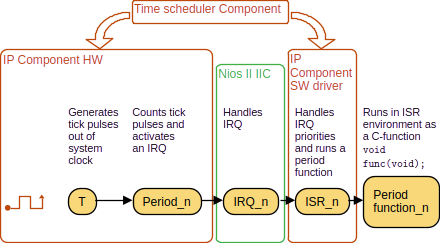

# Requirement Specification with RTM
The purpose of this project is to create a complete component that manages the execution of functions (implemented as standard C-functions) according to a predefined time schedule. The component is referred as Time Scheduler component in the project.

## Functional Requirements
Time scheduler functionality is designed according to functional diagram, shown on Figure 1.

  

### 1. Component Functionality

**1.1 The component shall repeatedly execute a C-function at a predetermined time interval, referred to as a period.**  
- **Acceptance Criteria**: The C-function should execute every X milliseconds without failure.  
- **Verification**: Unit Test  
- **Status**: Completed  

**1.2 Each C-function managed by the component shall be linked to a specific time period, referred to as a period function.**  
- **Acceptance Criteria**: The system correctly maps functions to specific periods in configuration.  
- **Dependencies**: 1.1  
- **Status**: Not Started  
- **Verification**: Configuration Validation, Functional Test  

**1.3 In case of overlap, the scheduler shall prioritize period functions based on predefined priorities.**  
- **Priority**: High  
- **Acceptance Criteria**: The scheduler correctly handles overlaps and executes functions in the correct order.  
- **Dependencies**: 1.2  
- **Status**: Completed  
- **Verification**: Functional Test, Scheduler Test  

**1.4 If a period function’s execution exceeds its assigned period length:**  
  - **1.4.1 The function shall be allowed to complete.**  
  - **1.4.2 The next execution shall start at the subsequent period.**  
  - **1.4.3 Such cases shall be logged as period misses.**  
- **Priority**: High  
- **Acceptance Criteria**: Function completes before the next execution cycle begins.  
- **Dependencies**: 1.1  
- **Status**: Verified  
- **Verification**: Timing Test, System Test  

### 2. Integration and Configuration

**2.1 The component shall interface with a Nios® II processor via Avalon® interfaces.**  
- **Priority**: High  
- **Acceptance Criteria**: Avalon interface correctly handles data exchange with the Nios II processor.  
- **Dependencies**: None  
- **Status**: Completed  
- **Verification**: Hardware Interface Test  

**2.2 The component shall allow configuration of the following parameters in Quartus Platform Designer:**  
  - **2.2.1 The number of periods the component will handle.**  
  - **2.2.2 The priority for each period.**  
  - **2.2.3 The time interval for each period.**  
- **Priority**: Medium  
- **Acceptance Criteria**: All configuration parameters can be set via Quartus Platform Designer.  
- **Dependencies**: None  
- **Status**: In Progress  
- **Verification**: Configuration Test  

---

## Requirements Traceability Matrix (RTM)

| Requirement ID | Description                                                                           | Status      | Verification Method     | Test Results | PR Links |
|----------------|---------------------------------------------------------------------------------------|-------------|-------------------------|--------------|----------|
| 1.1            | The component shall repeatedly execute a C-function at a predetermined time interval. | Not Started | Unit Test               | Pending      | #20      |
| 1.2            | Each C-function shall be linked to a specific time period.                            | Not Started | Functional Test         | Pending      | #21      |
| 1.3            | Scheduler prioritizes period functions based on predefined priorities.                | Completed   | Functional Test         | Passed       | #22      |
| 1.4.1          | Function shall complete even if it exceeds the period length.                         | Verified    | Timing Test             | Passed       | #23      |
| 2.1            | The component shall interface with a Nios II processor via Avalon interfaces.         | Completed   | Hardware Interface Test | Passed       | #24      |
| 2.2.1          | The number of periods the component will handle must be configurable.                 | In Progress | Configuration Test      | Pending      | #25      |

---

## How to Use the Document

### Requirements Management:
- **Each Requirement** is listed with clear details, including priority, acceptance criteria, status, and verification methods.
- **Traceability**: Each requirement can be tracked through its status (e.g., **Not Started**, **In Progress**, **Completed**, **Verified**) using the RTM.
- **Dependencies**: Dependencies are clearly noted for requirements that are dependent on others before they can be implemented or tested.

### RTM:
- The **Requirements Traceability Matrix (RTM)** provides a high-level view of the status of each requirement, linking them to milestones, labels, and test results.
- The **Status** of each requirement is tracked (e.g., "Not Started," "In Progress," "Completed," "Verified").
- The **Test Results** column is used to track the success or failure of tests associated with each requirement.

---

### How to Maintain the Document:
1. **Updating Status**: As work progresses, the status of each requirement should be updated in both the main specification and RTM table.
2. **Verification**: The test results should be updated once tests are executed.
3. **Linking to Code**: When pull requests are merged, link them to the corresponding requirements in the **PR Links** column.
4. **Dependencies**: Keep track of interdependencies between requirements, especially if one requirement cannot be implemented until another is completed.

---
